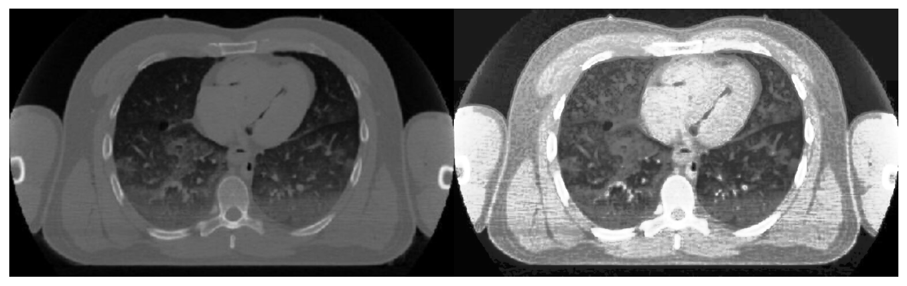

## Demo 6 - Easier Method to Perform Histogram Equalization of an Image

In the DataCamp lesson Analyzing Time Series and Images, we learned how to equalize an image using a historgram, which resulted in a sharper image contrast. This process was quite long, and involved plotting a histogram and CDF of the image's pixel values, and using those plots to equalize the image. 

I found a method of doing the same thing that is simpler and requires fewer steps, so I thought I would share it with you all.  

```python
# read in image and convert to greyscale
orig = cv2.imread('CT_scan.jpg')
orig_grey = cv2.cvtColor(orig, cv2.COLOR_BGR2GRAY)
```

Some images can be equalized globally using this method, but the image I chose for this demo doesn't lend itself well to that. So I converted it to a CLAHE object first.

CLAHE stands for Contrast Limited Adaptive Histogram Equallization, and means that the image is broken into smaller regions (called tiles) and each tile is adjusted separately from the picture as a whole. After this contrast adjustment, the tiles are joined together using bilinear interpolation. 

```python
# convert image to CLAHE object
clahe = cv2.createCLAHE(tileGridSize=(2,2))
orig_cl = clahe.apply(orig_grey)
```

After converting the image to a CLAHE object, I performed the equalization. As you can see, it takes only two lines of code, which is much more efficient than the previous method. 

```python
# create new equalized image from the clahe original
new = cv2.equalizeHist(orig_cl)
```

Here are the results: on the left is the original image, and on the right is the new, equalized image.
```python
# Stack the original image and new image side-by-side
res = np.hstack((orig_grey,new))
cv2.imwrite('res.png', res)
plt.imshow(res, cmap='gray')
plt.axis('off')
```

    

    
Note: code written in python
